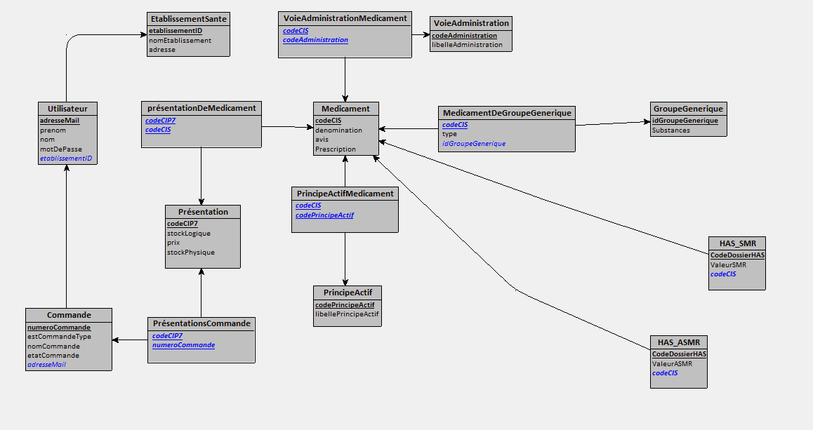

Equipe MIAGiles :

CABROL Camille, BENSAADA Abdallah, KONUSHBAEVA Begimay, MOUSSOLNA Adam

# Rendu BD

## Introduction

Pour cette itération, nous devions fournir un modèle relationel ainsi que des contraintes permettant d'assurer l'intégrité de la base de donnée.

## Schéma Relationel

## Contraintes liées au contexte métier

Le stock logique et le stock phisique ne peuvent pas être inférieur à zéro
--> 
-StockLogique > 0
-StockPhysique >0

Le stock logique est forcément inférieur au stock physique 
--> 
StockLogique <= StockPhysique

Situations critiques :
Deux utilisateurs commandent une présentation P1 simultanément alors qu'il n'en reste qu'un exemplaire, 